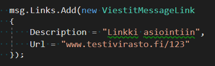

# Suomi.Fi/Viestit -Hub Client
> Nuget package for sending messages to Suomi.fi/viestit -service through MIP-hub

*Rest of this document is in Finnish.*

Tämä Nuget-paketti on tarkoitettu julkishallinnon organisaatioille yhteiskäyttöisenä kirjastona suomi.fi/viestit -palvelun käyttämiseen MIP-Hubin kautta. Käyttöönottoa varten täytyy olla haettuna organisaation palvelutunnukset, sekä hoidettuna pääsy hubille. Lisätietoa Viestit-palvelun käyttöönotosta ja hubista:

* [Suomi.fi-viestit käyttöönotto](https://esuomi.fi/palveluntarjoajille/viestit/)
* [Hubin kuvaus](https://www.joinex.com/sites/mip.io/index.html) ja siitä käytetty [ASTI-rajapinta](https://www.joinex.com/sites/mip.io/mip.io-asti/index.html)

## Asennus

Nuget-paketin voi ladata: <https://www.nuget.org/packages/Keha.SuomiFiViestitHub.Client/>

**Huom** toimiva käyttö vaatii palvelutunnukset, sekä pääsyn Hubille.

## Käyttöesimerkit

HubClient-instanssi luodaan antamalla seuraavat tiedot `ClientConfiguration` -tyyppinä:

* Käytössä olevan Hubin osoite- ja porttitiedot
* Viestit-palvelun käyttöönotossa saadut tunnukset

Rakentajan HttpClient-parametrin voi jättää arvoksi `null`, jolloin sellainen alustetaan annetun konfiguroinnin pohjalta. 


Tämän jälkeen instanssilla voidaan suorittaa asynkronisia kyselyitä.

Seuraavan kuvan tapaan tarkastetaan onko annetulla henkilötunnuksella käytössä Viestit-tili, paluuarvona on `true` mikäli käyttäjällä on tili, ja se on *aktiivinen*:


Aktiiviselle tilille lähetettävä viesti annetaan `ViestitMessage`-tyyppinä:

* Viestin teksti ei tunnista muotoilua, linkit on annettava erillisenä listana
* Jos viestiin ei tule linkkejä tai liitetiedostoja, voi kentät jättää alustamatta


Yksittäiset linkit ja tiedostot luodaan seuraavasti:




Viestin lähetys suoritetaan asynkronisesti:


Paluuarvona tulee `SentMessageStatus`, jonka property `MessageStateCode MsgState` on arvolla 200 tai 202, jos viestin tallennus onnistui.

**ConsoleTester** -projektissa on nähtävissä yksinkertaiset käyttötapaukset kirjaston tarjoamista metodeista rajapinnan käyttöön.

### Kirjerajapinta

Kirjerajapintaa kutsutaan ```SendPrintableMessageToViestit``` kautta ja se toimii pitkälti kuten ```SendMessageToViestitService```. Kutsuun vaaditaan lisänä osoitetiedot ja tulostustoimittaja. Toiminto tukee ainoastaan yhden tulostusmuotoillun PDF-tiedoston lähettämistä. Tulostustoiminnallisuus vaatii tehdyt sopimukset VRK:n ja tulostustoimittajan kanssa, lisätietoja voi lukea [rajapintakuvauksesta](https://www.joinex.com/sites/mip.io/mip.io-asti/sanomat.html#lahetaviesti).


**Huom!** Testausvaiheessa tulee asettaa ```TestingOnlyDoNotSendPrinted = true```, jotta lähetetyt viestit eivät oikeasti mene tulostuspalveluun.

### Virhetilanteet

Virhetilanteet tulevat poikkeuksina:

* Jos hubiin yhteyden saamisessa on virheitä, `HttpClient` heittää `HttpExceptionin`
* Jos hubi palauttaa `tilaKoodi` -kentässä virhekoodin, kirjasto heittää kustomoidun poikkeuksen, jotka löytyvät kuvattuna nimialueesta `Keha.SuomiFiViestitHub.Client.Exceptions`
    * Mikäli heitetty poikkeus on tyyppiä `ClientFaultException`, tämä Nuget-paketti ei todennäköisesti enää vastaa hubin rajapintaa, ja se tulisi päivittää

_Lisätietoja viestien tilakoodeista voi lukea hubin [rajapintakuvauksesta](https://www.joinex.com/sites/mip.io/mip.io-asti/index.html)._

## Kehitysympäristö

Windows:

* Toteutettu Visual Studio 2017:lla, projektit:
    * `Client` tuottaa Nuget-paketin, .NET-Standard 2.0
    * `ClientTests` sisältää yksikkötestit kirjastolle, .NET-Framework 4.6.1
    * `ConsoleTester` on konsolisovellusesimerkki kirjaston käytöstä, .NET-Framework 4.6.1

Muut (Linux, iOS):

* Testaamatta, Client-projektin pitäisi .NET Standardina toimia muissakin ympäristöissä

## Julkaisuhistoria

* 0.2.0
    * Lisätty lahetaviesti -rajapinta
* 0.1.0
    * Ensijulkaisu

## Meta

Antti Sarjanoja – <antti.sarjanoja@gofore.com>

Jaettu MIT-lisenssillä. Lue `LICENSE`:stä tarkempi kuvaus.

## Kontribuointi

1. Fork (<https://github.com/ELY-KEHA/SuomiFiViestitHubClient/fork>)
2. Feature branch (`git checkout -b feature/fooBar`)
3. Commit (`git commit -am 'Add some fooBar'`)
4. Push branch (`git push origin feature/fooBar`)
5. Tee uusi Pull Request
